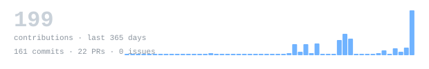
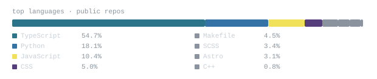

[github.com/sanjay-offl](https://github.com/sanjay-offl) &nbsp;·&nbsp;
[linkedin](https://www.linkedin.com/in/sanjayoffl24/) &nbsp;·&nbsp;
[email](mailto:sanjayoffl24@gmail.com)

> B.E. CSE at PPG Institute of Technology, Coimbatore. 
> CTO at a funded startup. Community Lead at Codera. 
> AI, modern tech, and thoughtful product design for real problems.

I build fast, ship to real users, and kill what doesn't work. Right now that's 
[UrbanMind](https://github.com/sanjay-offl/THADAM-AI) — an AI-powered civic intelligence portal that transforms raw citizen 
grievances into actionable urban intelligence. Also deep into AI-native products 
and community-led developer ecosystems through [Codera](https://github.com/sanjay-offl).

<samp>python &nbsp; typescript &nbsp; javascript &nbsp; react &nbsp; next.js &nbsp; node.js &nbsp; fastapi &nbsp; postgres &nbsp; mongodb &nbsp; firebase &nbsp; tailwind &nbsp; docker &nbsp; git &nbsp; linux</samp>

**[THADAM AI](https://github.com/sanjay-offl/THADAM-AI)** &nbsp;·&nbsp; <samp>python, next.js, ai/llms</samp> 
Tamil Heritage and Digital Archive Management. AI-powered preservation 
of cultural knowledge with intelligent retrieval and multimodal understanding.

**[UrbanMind](https://github.com/sanjay-offl)** &nbsp;·&nbsp; <samp>next.js 14, fastapi, gemini, postgres, redis</samp> 
AI citizen grievance intelligence portal for UN SDG 16. Transforms raw 
civic complaints into structured urban intelligence for city administrators.

**[CyberShield AI](https://github.com/sanjay-offl/cybersecure-ai)** &nbsp;·&nbsp; <samp>python, typescript, ai/llms</samp> 
AI-powered cybersecurity threat detection and analysis platform. 
Real-time vulnerability assessment with intelligent remediation guidance.

**[FAYNEX](https://github.com/sanjay-offl)** &nbsp;·&nbsp; <samp>next.js, node.js, mongodb</samp> 
Full-stack product built as a funded startup CTO. End-to-end system 
design, API architecture, and production deployment.

**[ODFE](https://github.com/sanjay-offl)** &nbsp;·&nbsp; <samp>next.js 14, node.js, prisma, typescript</samp> 
Full-stack Cafe POS system built in 24 hours at a hackathon. Odoo 
backend, Next.js frontend, real-time order and inventory management.

**[Pleco AI](https://github.com/sanjay-offl)** &nbsp;·&nbsp; <samp>python, react, ai/llms</samp> 
AI-first product with deep LLM integration. Built around real user 
workflows with a focus on speed and minimal friction.

Every graphic here is generated, not embedded from anyone else's server. 
`ascii.svg` is a photo pushed through a character ramp by 
[`scripts/make_portrait.py`](scripts/make_portrait.py); the stat graphics and 
section headings are drawn by [a scheduled action](.github/workflows/stats.yml) 
straight from the GitHub GraphQL API, once a day, committing only what changed.

They animate with SMIL inside the SVG, because GitHub strips scripts from 
READMEs — and since nothing loads from a third party, nothing here can 
rate-limit or go dark. The headings are SVGs for the same reason: GitHub 
strips CSS, so an image is the only way to put this page's own typeface on them.

Language totals cover public repositories only. `year.svg` uses the portrait's 
character ramp: `:` `+` `#` `@`, quiet to loud.
